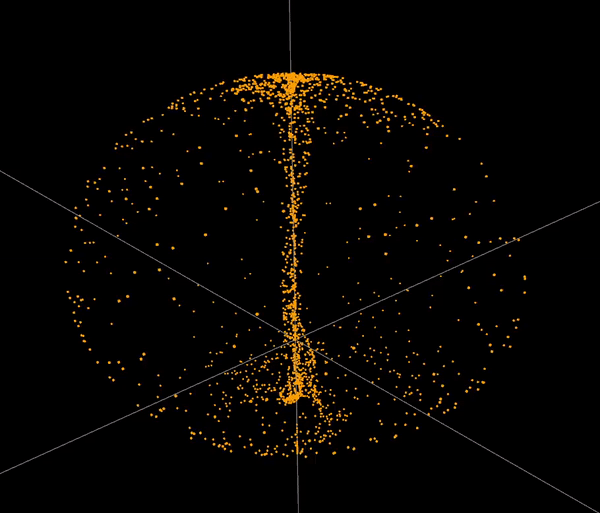
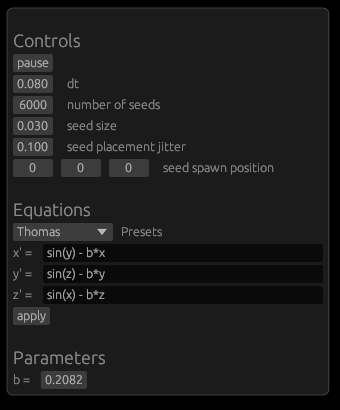
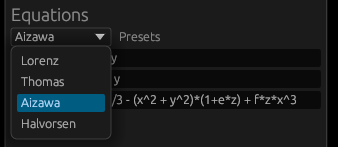
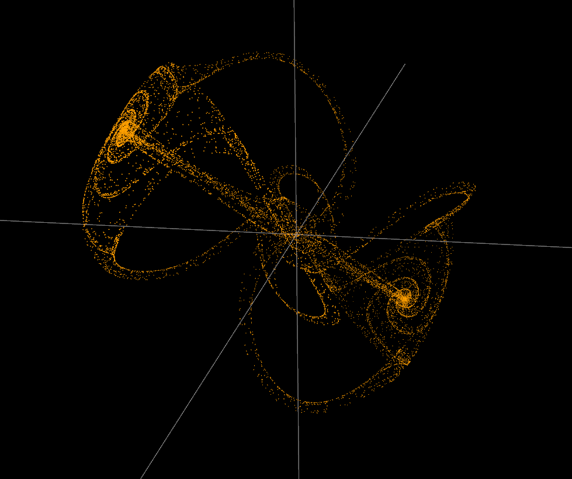
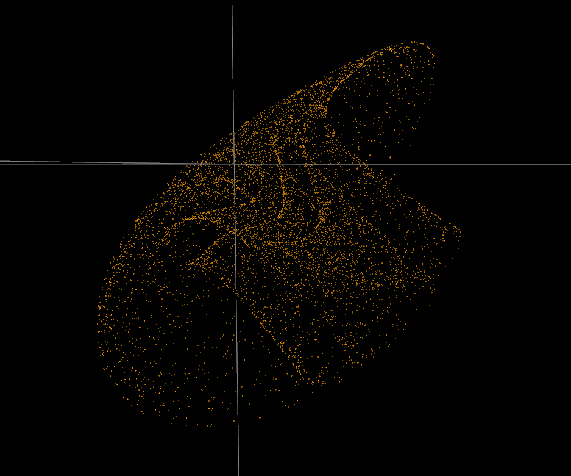

# Chaotic Attractors Simulator

## Rich control over the simulation

In this window you can control basic simulation parameters, and also write your own differential equations. The software will parse your notation and apply it to the simulation. Any parameters will be editable below.

## Presets

### Lorenz attractor

https://github.com/gre-v-el/Chaotic-Attractors/assets/95856287/b479010a-bafc-4a97-a5c9-215271f224bb

### Thomas attracor

https://github.com/gre-v-el/Chaotic-Attractors/assets/95856287/174718a4-299b-4f73-8325-9ef2a4cd1788

### Halvorsen attractor

